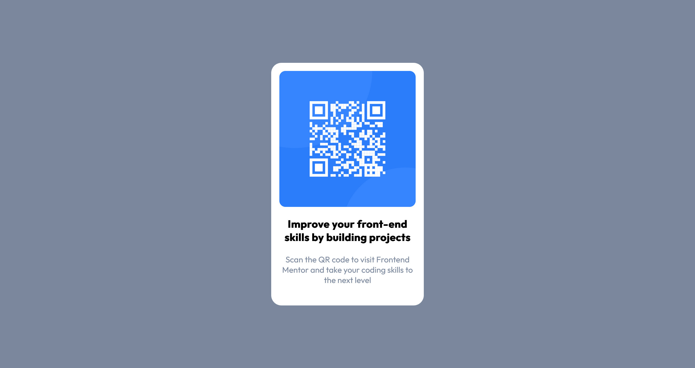

# Frontend Mentor - QR code component solution

This is a solution to the [QR code component challenge on Frontend Mentor](https://www.frontendmentor.io/challenges/qr-code-component-iux_sIO_H). Frontend Mentor challenges help you improve your coding skills by building realistic projects.

## Table of contents

-   [Overview](#overview)
    -   [Screenshot](#screenshot)
    -   [Links](#links)
-   [My process](#my-process)
    -   [Built with](#built-with)
    -   [What I learned](#what-i-learned)
    -   [Continued development](#continued-development)
    -   [Useful resources](#useful-resources)
-   [Author](#author)

## Overview

### Screenshot

### Links

-   Solution URL: [Add solution URL here](https://your-solution-url.com)
-   Live Site URL: [Add live site URL here](https://your-live-site-url.com)

## My process

### Built with

-   Semantic HTML5 markup
-   SCSS
-   Flexbox

### What I learned

I tried my experience with SCSS on this "simple" project.

### Continued development

For the next projects I want to extend my SCSS skills and I also in connection with Javascript.

### Useful resources

-   [Udemy SCSS](https://www.udemy.com/course/durchstarten-mit-sass-scss/) - Here I learned my first SCSS skills

## Author

-   Website - [WP Helping Hand](https://www.wp-helping-hand.com)
